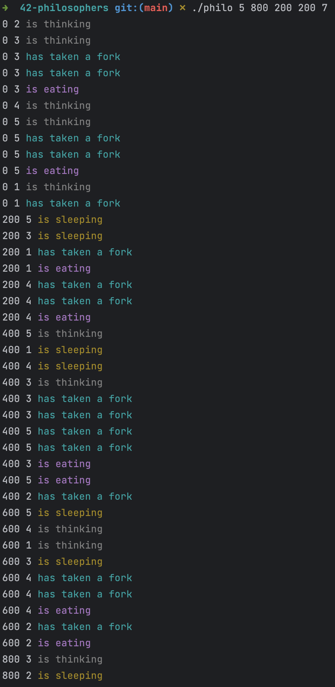
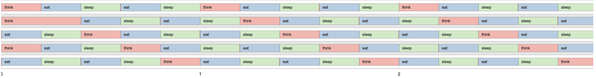

# Philosophers Project

## Description
This is a project for the school 42. The goal of this project is to implement a simulation of the dining philosophers problem ([formulated by Dijkstra](https://en.wikipedia.org/wiki/Dining_philosophers_problem)) using threads and synchronization.

## Installation
1. Clone the repository: `git clone https://github.com/tdameros/42-philosophers.git`
2. Navigate to the project directory: `cd 42-philosophers`
3. Build the program: `make`

## Usage
To run the program, simply execute the `./philo` binary with the following arguments:

```shell
./philo <number_of_philosophers> <time_to_die> <time_to_eat> <time_to_sleep> [number_of_times_each_philosopher_must_eat]
```


Here is a brief explanation of each argument:

- `<number_of_philosophers>`: the number of philosophers that will be seated at the table.
- `<time_to_die>`: the maximum time (in milliseconds) a philosopher can go without eating before dying.
- `<time_to_eat>`: the time (in milliseconds) it takes for a philosopher to eat.
- `<time_to_sleep>`: the time (in milliseconds) it takes for a philosopher to sleep.
- `[number_of_times_each_philosopher_must_eat]`: (optional) the number of times each philosopher must eat before the simulation ends.

## Example
Here is an example of how to run the program with 5 philosophers who each have 800 milliseconds to live without food, 200 milliseconds to eat, and 200 milliseconds to sleep, and each must eat at least 7 times:

```shell
./philo 5 800 200 200 7
```


